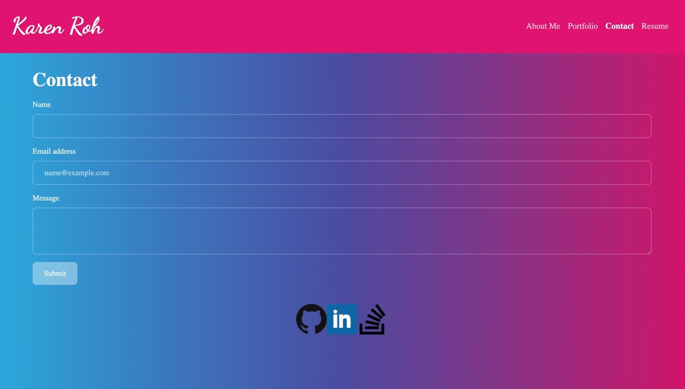

# 20 React: React Portfolio

[](https://opensource.org/licenses/MIT)

## Description

[_Deployed React Portfolio!_](https://kroh1031.github.io/week-20-react-portfolio/)

This is a front-end application that utilizes React to create reusable UI components and dynamically render pages.

## Table of Contents

- [Installation](#installation)

- [Usage](#usage)

- [License](#license)

- [Mock-Up](#mock-up)

- [Questions](#questions)

## Installation

To install necessary dependencies, run the following command:

```
npm i
```

## Usage

To launch the application, run the following command:

```
npm start
```

## License

This project is licensed under the MIT license.  
https://opensource.org/licenses/MIT

## Mock-Up

The following images show the web application's appearance and functionality:

**About Me Page:**


**Contact Page:**


## Questions

If you have any questions about the repo, open an issue or contact me directly at karenroh@hotmail.com.  
You can find more of my work at [kroh1031](https://github.com/kroh1031).
